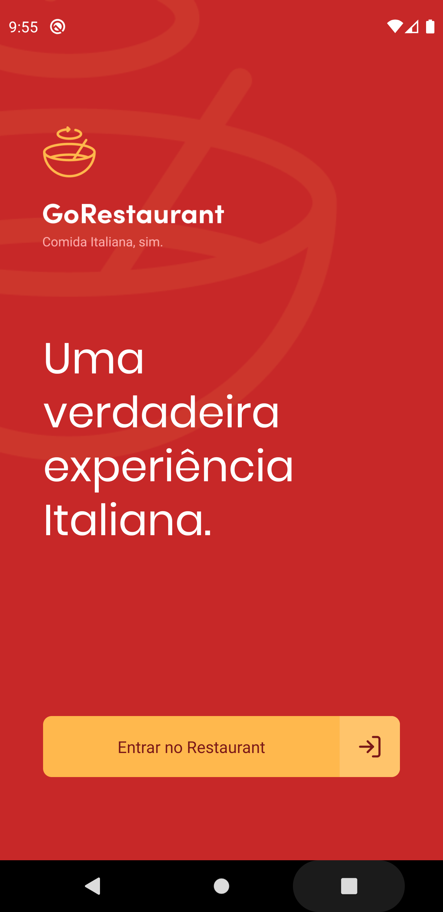
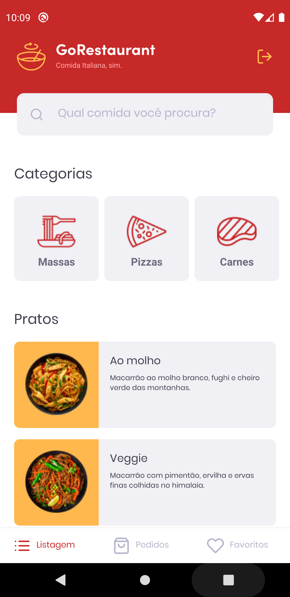
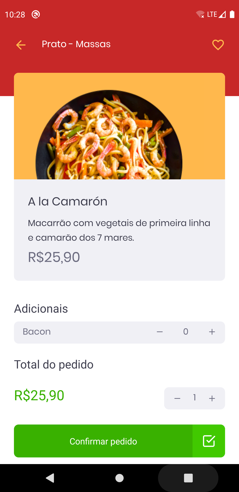

<h1 align="center">Welcome to GoRestauranteApp  👋</h1>
<p>
  
</p>

> Aplicativo em React Native GoRestaurant

## Imagens




## Install

```sh
yarn
```

## Usage

### Run Fake API

```sh
yarn json-server server.json -p 3333
```


```sh
yarn android or yarn ios
```


## Run tests

```sh
yarn run test
```

## Author

👤 **Victor Marinho**

* Github: [@victorcmarinho](https://github.com/victorcmarinho)
* LinkedIn: [@victorcmarinho](https://linkedin.com/in/victorcmarinho)

## Show your support

Give a ⭐️ if this project helped you!

***
_This README was generated with ❤️ by [readme-md-generator](https://github.com/kefranabg/readme-md-generator)_